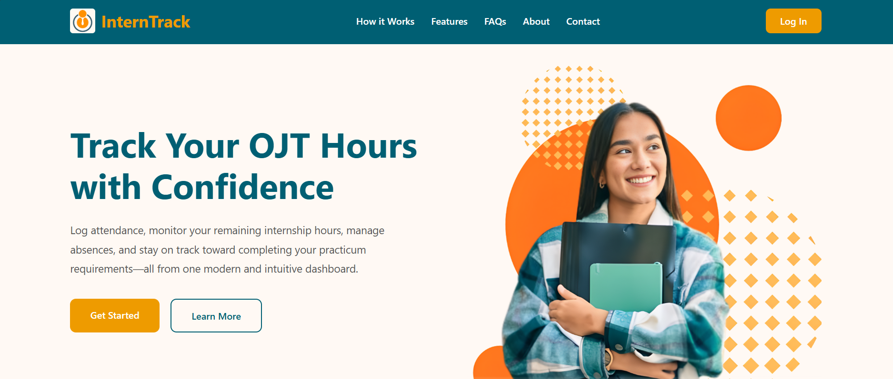
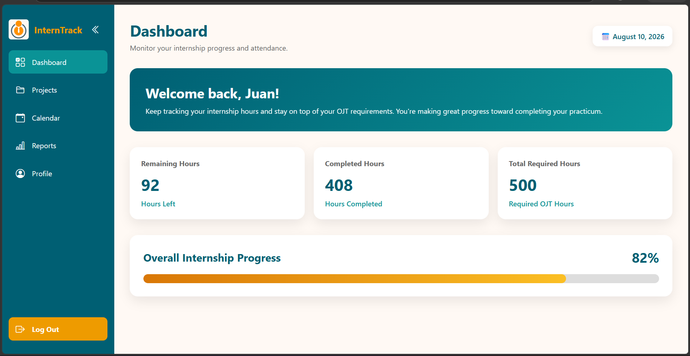
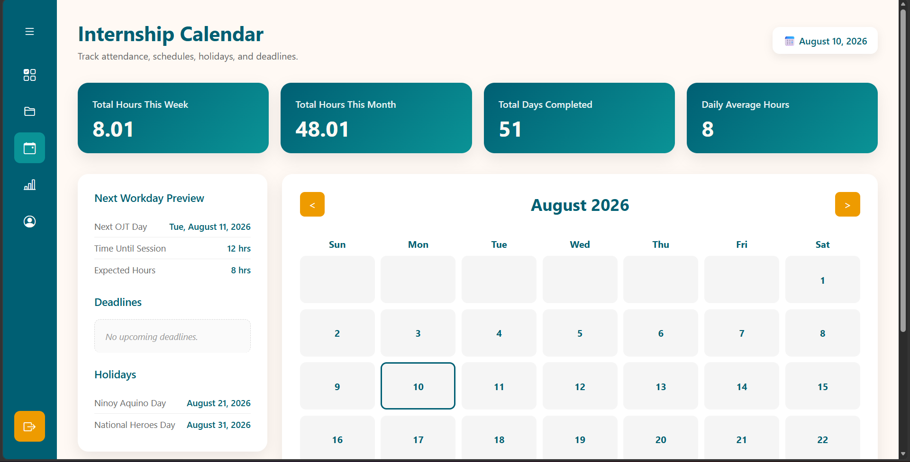
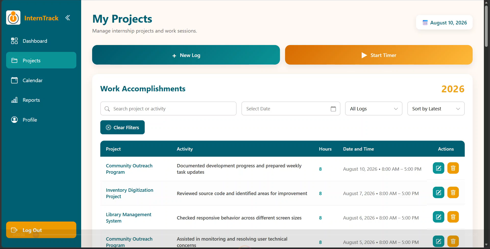
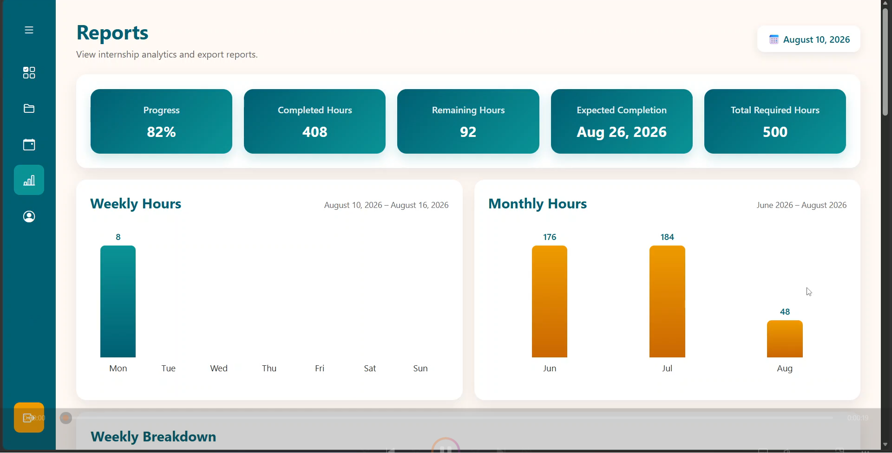
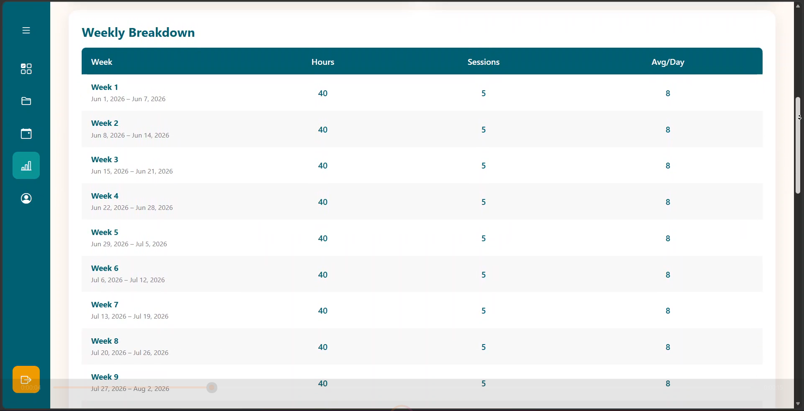
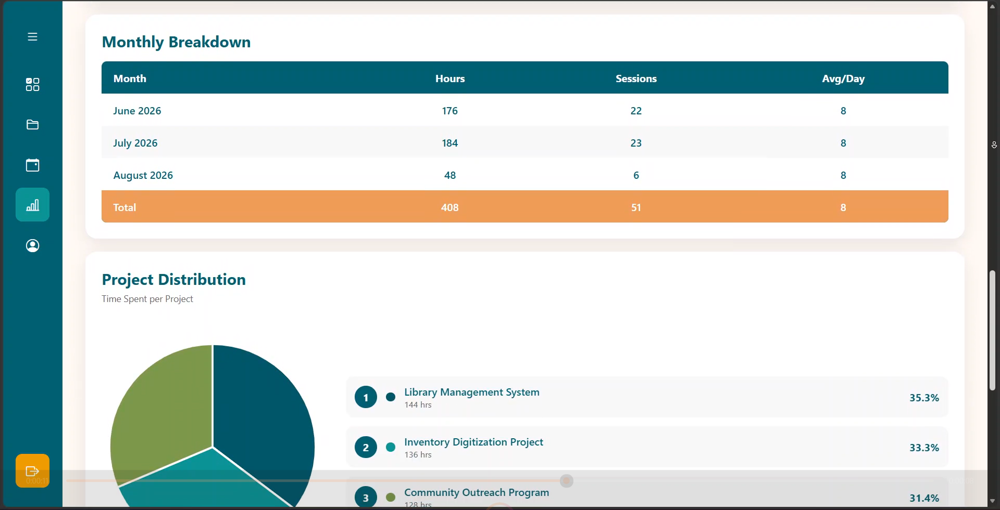
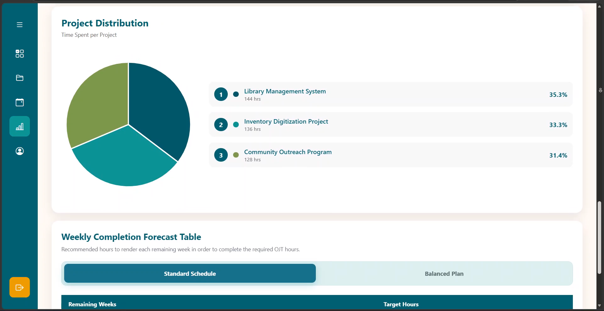
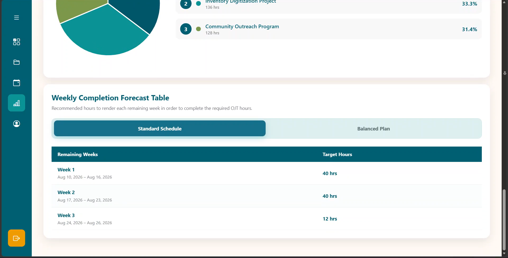

# InternTrack
---


## Overview

InternTrack is a web-based internship management system designed to simplify how students monitor and organize their internship experience. It centralizes attendance records, work logs, rendered hours, schedules, and progress tracking into a single application, reducing the need for manual calculations and spreadsheets.

The project was developed as a full-stack web application using PHP and MySQL in a local development environment. It features secure user authentication, CRUD functionality, database integration, and responsive web design while demonstrating practical full-stack development concepts.

Although originally developed as a self-hosted application, the system architecture supports multiple user accounts through authentication and individual data separation.

<h3>Landing Page</h3>


<h3>Dashboard</h3>


<h3>Calendar</h3>


<h3>Projects</h3>


<h3>Reports - Overview</h3>


<h3>Reports - Weekly Report</h3>


<h3>Reports - Monthly Report</h3>


<h3>Reports - Charts</h3>


<h3>Reports - Weekly Completion Forecast Table </h3>


---

## Project Highlights

- User authentication and session management
- Attendance and internship hour tracking
- Daily work log management
- Manual and timer-based session recording
- Internship progress monitoring
- Estimated internship completion forecasting
- Calendar with schedules, deadlines, and holidays
- Reports and data visualization
- Responsive web interface
- Relational database using MySQL

---

## Features

### Authentication

- User registration
- Secure login
- Logout
- Session management

### Dashboard

- Internship overview
- Rendered hours summary
- Remaining hours
- Progress indicators
- Quick statistics

### Attendance

- Time In / Time Out
- Manual session logging
- Timer-based tracking
- Attendance history

### Daily Logs

- Record daily accomplishments
- Edit existing logs
- Delete entries
- View previous records

### Progress Tracking

- Total rendered hours
- Remaining internship hours
- Completion percentage
- Estimated completion date

### Calendar

- Internship schedule
- Holidays
- Deadlines
- Important dates

### Reports

- Attendance reports
- Internship summaries
- Charts and visual statistics

### Profile

- User profile management
- Internship information
- Account settings

---

## SQL Database Structure
## users

| Column | Data Type |
|---------|-----------|
| id (Primary Key) | INT |
| first_name | VARCHAR |
| last_name | VARCHAR |
| email | VARCHAR |
| password | VARCHAR |
| created_at | TIMESTAMP |
| student_id | VARCHAR |
| school | VARCHAR |
| degree_program | VARCHAR |
| company | VARCHAR |
| department | VARCHAR |
| position_role | VARCHAR |
| supervisor | VARCHAR |
| professor | VARCHAR |
| required_hours | INT |
| hours_per_day | INT |
| start_time | TIME |
| end_time | TIME |
| working_days | VARCHAR |

---

## projects

| Column | Data Type |
|---------|-----------|
| id (Primary Key) | INT |
| user_id (Foreign Key → users.id) | INT |
| project_name | VARCHAR |
| activity | TEXT |
| work_date | DATE |
| start_time | TIME |
| end_time | TIME |
| hours | DECIMAL(4,2) |
| created_at | TIMESTAMP |

---

## deadlines

| Column | Data Type |
|---------|-----------|
| id (Primary Key) | INT |
| user_id (Foreign Key → users.id) | INT |
| title | VARCHAR |
| notes | TEXT |
| due_date | DATE |
| due_time | TIME |
| is_completed | BOOLEAN (TINYINT(1)) |
| created_at | TIMESTAMP |

---

## active_timer

| Column | Data Type |
|---------|-----------|
| id (Primary Key) | INT |
| user_id (Foreign Key → users.id) | INT |
| project_name | VARCHAR |
| activity | TEXT |
| started_at | DATETIME |
| created_at | TIMESTAMP |

---

## Technology Stack

### Frontend

- HTML5
- CSS3
- JavaScript
- Bootstrap

### Backend

- PHP

### Database

- MySQL

### Development Environment

- XAMPP
- Apache
- phpMyAdmin
- Visual Studio Code

### Version Control

- Git
- GitHub

---

## System Requirements

The following software is required to run the application locally.

- XAMPP (Apache and MySQL)
- PHP 8.x
- MySQL
- phpMyAdmin
- Modern web browser
- Git (optional, for cloning the repository)

---

## Installation

### 1. Clone the repository

```bash
git clone https://github.com/yourusername/interntrack.git
```

### 2. Move the project

Copy the project folder into your XAMPP `htdocs` directory.

Example:

```
C:\xampp\htdocs\InternTrack
```

### 3. Start XAMPP

Open XAMPP Control Panel and start:

- Apache
- MySQL

### 4. Import the database

Open phpMyAdmin.

Create a database named:

```
interntrack
```

Import the SQL file located in:

```
database/interntrack.sql
```

### 5. Configure the database connection

Update the database configuration if necessary.

Example:

```php
Host: localhost
Database: interntrack
Username: root
Password:
```

### 6. Launch the application

Open your browser and navigate to

```
http://localhost/InternTrack
```

---

## How to Use

1. Create a user account.
2. Log in to the application.
3. Set up your internship information.
4. Record attendance using manual entry or the built-in timer.
5. Add daily internship logs.
6. Monitor rendered and remaining internship hours.
7. Track internship progress.
8. View reports and charts.
9. Manage schedules and important dates through the calendar.

---

## Learning Outcomes

This project strengthened my experience in:

- Full-stack web development
- PHP application development
- MySQL database design
- CRUD operations
- User authentication
- Session management
- Database relationships
- Form validation
- Responsive web design
- Debugging and testing
- Version control using Git

---

## Future Improvements

Potential enhancements include:

- Email notifications
- PDF report generation
- Dark mode
- Mobile optimization
- Administrator dashboard
- Cloud database deployment
- Automatic backup system

---

## Disclaimer

InternTrack was developed as a self-hosted web application intended to run in a local development environment.

The application has been tested using XAMPP with Apache and MySQL. Additional configuration may be required for deployment to a production web server.

Any screenshots or demonstration data included in this repository are sample data used for testing and presentation purposes.

---

## Contributor

**Aaronne Christian E. Dela Cruz**
